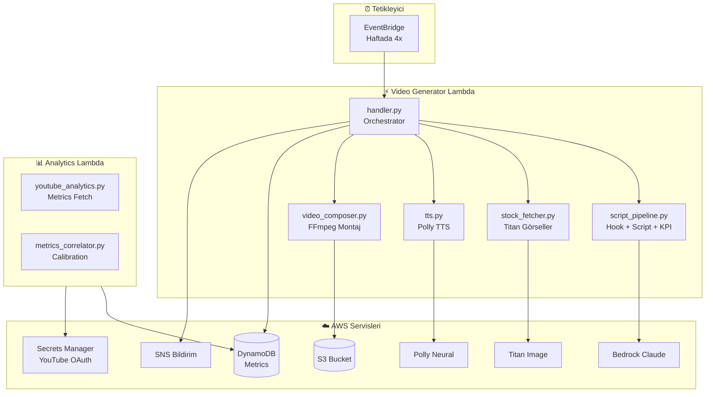

# 🎬 History YouTube Shorts Generator

AI-powered otomatik YouTube Shorts video oluşturucu. Tarihi içerikler üzerine viral-ready 15 saniyelik videolar üretir. **YouTube Analytics entegrasyonu ile performans ölçümü ve kalibrasyon** yapabilir.

## 🏗️ Sistem Mimarisi



## 🔄 Video Oluşturma Akışı

```
1️⃣ SCRIPT GENERATION (script_pipeline.py)
   ├── Topic seçimi + Diversity Gate
   ├── Hook üretimi (3 varyant)
   ├── Hook KPI skorlama:
   │   └── instant_clarity, curiosity_gap, swipe_risk, predicted_retention
   ├── En iyi hook seçimi (clarity-first)
   └── Full script + kalite değerlendirme

2️⃣ VISUAL GENERATION (stock_fetcher.py)
   ├── Titan Image Generator (4 segment)
   ├── Ken Burns efekti (zoom/pan)
   └── Visual Relevance skorlama

3️⃣ AUDIO GENERATION
   ├── tts.py → Polly Neural seslendirme
   ├── music_fetcher.py → Mood bazlı müzik
   └── sfx_generator.py → Bağlamsal SFX

4️⃣ VIDEO COMPOSITION (video_composer.py)
   ├── FFmpeg birleştirme
   ├── ASS animasyonlu altyazılar
   └── Era bazlı film efektleri

5️⃣ DELIVERY + TRACKING
   ├── S3 Upload
   ├── DynamoDB → Kalibrasyon metrikleri kaydet
   └── SNS → E-posta bildirim
```

## 📊 YouTube Analytics Entegrasyonu (YENİ)

### Kalibrasyon Döngüsü

```
Video üretildi → DynamoDB'ye tahminler kaydedildi
      ↓
24-72 saat bekle (YouTube analytics hazırlanır)
      ↓
Analytics Lambda → YouTube API'den gerçek metrikler çek
      ↓
Correlator → Tahmin vs Gerçek karşılaştırma
      ↓
Rubric ağırlıkları ayarla (gerekirse)
```

### DynamoDB'ye Kaydedilen Alanlar

| Kategori | Alanlar |
|----------|---------|
| **Kimlik** | video_id, publish_time_utc |
| **Pipeline** | pipeline_version, mode (fast/quality) |
| **Tahminler** | predicted_retention, hook_score |
| **Hook KPI** | instant_clarity, curiosity_gap, swipe_risk |
| **Görsel** | visual_relevance |
| **İçerik** | era, topic_entity |
| **Dağıtım** | title_variant_type (safe/bold/experimental) |
| **Sonuç** | actual_retention, analytics_fetched_at_utc |

### Correlator Çıktısı

```
--- MAIN METRICS ---
Correlation (predicted vs actual): 0.65
MAE (Mean Absolute Error): 12.3%

--- FEATURE CORRELATIONS ---
  Instant Clarity: 0.52 (Strong)
  Curiosity Gap: 0.41 (Moderate)
  Visual Relevance: 0.38 (Moderate)

--- MODE ANALYSIS ---
  FAST: n=7, corr=0.58, MAE=14.2%
  QUALITY: n=3, corr=0.72, MAE=8.1%
```

### Kalibrasyon Komutu

```powershell
cd historical/lambda/video_creator
python -c "from metrics_correlator import generate_calibration_report; print(generate_calibration_report())"
```

## 📁 Proje Yapısı

```
historical/
├── 📄 README.md
├──  setup.ps1/setup.sh
│
├── 🏗️ terraform/
│   ├── main.tf              # S3, SNS, EventBridge
│   ├── lambda.tf            # Lambda + Layers
│   ├── iam.tf               # IAM roller
│   ├── dynamodb_metrics.tf  # Kalibrasyon tablosu (YENİ)
│   └── secrets.tf           # YouTube OAuth (YENİ)
│
└── ⚡ lambda/video_creator/
    ├── handler.py               # Ana orchestrator
    ├── script_pipeline.py       # Hook + Script + KPI
    ├── stock_fetcher.py         # Titan görseller
    ├── tts.py                   # Polly TTS
    ├── video_composer.py        # FFmpeg montaj
    ├── subtitle_gen.py          # ASS altyazılar
    ├── youtube_analytics.py     # YouTube API (YENİ)
    └── metrics_correlator.py    # Kalibrasyon (YENİ)
```

## 🚀 Kurulum

### Gereksinimler
- AWS CLI yapılandırılmış
- Terraform >= 1.0
- Python 3.11+

### Deploy

```powershell
cd historical/terraform
terraform init
terraform apply
```

### YouTube Analytics Kurulumu (Opsiyonel)

```powershell
# 1. Google Cloud Console'da OAuth2 credentials oluştur
# 2. Refresh token al
python get_youtube_token.py

# 3. AWS Secrets Manager'a kaydet
aws secretsmanager create-secret --name shorts/youtube-oauth --secret-string file://youtube_secret.json
```

### Manuel Çalıştırma

```powershell
# QUALITY mode (varsayılan)
aws lambda invoke --function-name youtube-shorts-video-generator --payload "{}" --invocation-type Event response.json

# FAST mode
aws lambda invoke --function-name youtube-shorts-video-generator --payload "{\"mode\": \"fast\"}" --invocation-type Event response.json

# Belirli konu
aws lambda invoke --function-name youtube-shorts-video-generator --payload "{\"topic\": \"Emu War\", \"era\": \"early_20th\"}" --invocation-type Event response.json
```

## 🎯 Özellikler

### İçerik Üretimi
| Özellik | Açıklama |
|---------|----------|
| Hook KPI Skorlama | instant_clarity, curiosity_gap, swipe_risk |
| Predicted Retention | 0-100 arası tahmin |
| Visual Relevance | Hook-görsel uyumu kontrolü |
| Title Generation | 3 varyant (safe/bold/experimental) |
| Diversity Gate | Tekrarlayan içerik engeli |

### Video Prodüksiyon
| Özellik | Açıklama |
|---------|----------|
| AI Görseller | Titan Image Generator |
| Ken Burns | Dinamik zoom/pan |
| Neural TTS | Polly seslendirme |
| Animasyonlu Altyazı | Word-by-word karaoke |
| Era Efektleri | Dönem bazlı film grain/sepia |

### Kalibrasyon Sistemi (YENİ)
| Özellik | Açıklama |
|---------|----------|
| YouTube Analytics | averageViewPercentage çekimi |
| 24-72h Retry | Otomatik yeniden deneme |
| Pearson Correlation | Tahmin-gerçek ilişkisi |
| MAE Hesaplama | Ortalama mutlak hata |
| Mode Analizi | FAST vs QUALITY karşılaştırma |
| Feature Analizi | Hangi KPI en etkili? |

## � Kalibrasyon Hedefleri

| Metrik | Başlangıç | Hedef (30 video) |
|--------|-----------|------------------|
| Korelasyon | 0.65 | ≥ 0.70 |
| MAE | 12.3% | ≤ 10% |
| FAST MAE | 14.2% | ≤ 12% |
| QUALITY MAE | 8.1% | ≤ 9% |

## � Maliyet (Video Başına)

| Servis | Tahmini |
|--------|---------|
| Bedrock Claude | ~$0.05 |
| Titan Image | ~$0.10 |
| Polly | ~$0.02 |
| Lambda | ~$0.003 |
| DynamoDB | ~$0.001 |
| **Toplam** | **~$0.17/video** |

## 🔒 Telif Durumu

✅ Tüm içerik AI tarafından üretilmiştir:
- **Script**: AWS Bedrock Claude
- **Görseller**: AWS Titan Image Generator
- **Ses**: AWS Polly Neural
- **Müzik**: Royalty-free (S3'de)

## 📝 Lisans

Özel proje - Tüm hakları saklıdır.
