# 🎬 YouTube Shorts AI Video Generator

**Tam otomatik, kendi kendini öğreten YouTube Shorts video üretim sistemi**

Tarihsel içerikler için AI destekli video üretimi yapar. Senaryo yazımından video render'ına, kalite skorlamasından YouTube Analytics takibine kadar tüm süreç otomatiktir. **Thompson Sampling** tabanlı autopilot sistemi ile parametreler gerçek YouTube performansına göre sürekli optimize edilir.

### 🆕 Son Güncellemeler (v2.4 — Scientific Phase)
- **🔬 Kalibrasyon Raporu**: 8 analiz ile evaluator doğruluğunu test eden bilimsel rapor sistemi
- **📏 Refine Delta Enstrümantasyonu**: `first_hook_score → final_hook_score` delta ile self-optimization tespiti
- **📊 Pearson Korelasyon Testi**: Hook score delta ↔ actual retention korelasyonu (Goodhart guardrail)
- **⚖️ Dual Jury Evaluator**: Sonnet (yapı) + Haiku (dikkat) ikili jüri — weighted scoring (S×0.4 + H×0.6)
- **🎯 Targeted Refine**: Haiku diagnostik verisi refiner'a enjekte ediliyor — cerrahi müdahale
- **🏄 Retention-Aware Diversity**: Yüksek retention (≥55%) alan kategoriler tekrar edebilir (wave surfing)
- **📊 Virality Score**: Retention × 1.5 + Stopping Power × 2.0
- **🎬 Visual Director**: 4 katmanlı sinematik prompt sistemi
- **🌍 Antropoloji & Kültür**: Yeni kategori — Aztek Ölüm Düdüğü, Tibet Gökyüzü Cenazesi

---

## 📋 İçindekiler

1. [Sistem Mimarisi](#-sistem-mimarisi)
2. [Video Üretim Pipeline](#-video-üretim-pipeline)
3. [Senaryo Pipeline (Dual Jury)](#-senaryo-pipeline-dual-jury)
4. [Kalibrasyon ve Bilimsel Faz](#-kalibrasyon-ve-bilimsel-faz)
5. [Konu Seçim Stratejisi (History Buffet)](#-konu-seçim-stratejisi-history-buffet)
6. [Virality Score](#-virality-score-performans-puanlama)
7. [Görsel Üretimi (Visual Director)](#-görsel-üretimi-visual-director)
8. [Ses & Müzik](#-ses--müzik)
9. [Autopilot Sistemi](#-autopilot-sistemi)
10. [YouTube Analytics](#-youtube-analytics-entegrasyonu)
11. [Admin Paneli & API](#-admin-paneli--api)
12. [AWS Altyapısı & Deployment](#-aws-altyapısı--deployment)
13. [Konfigürasyon](#-konfigürasyon)
14. [Sorun Giderme](#-sorun-giderme)

---

## 🌟 Sistem Mimarisi

### Yüksek Seviye Mimari

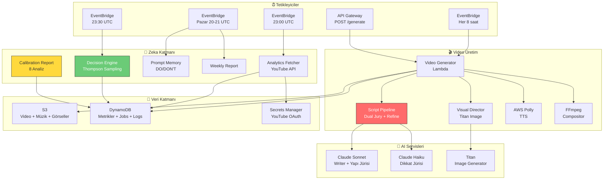

### Kapalı Döngü Optimizasyon

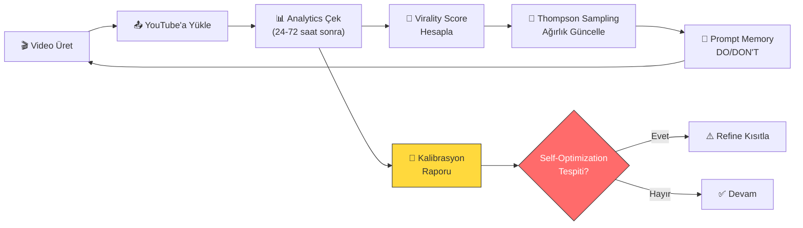

---

## 🔄 Video Üretim Pipeline

### Adım Adım Akış

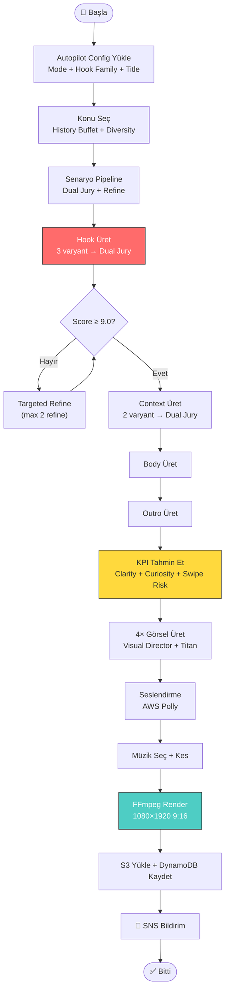

---

## 📝 Senaryo Pipeline (Dual Jury)

### Dosya: `lambda/video_creator/script_pipeline.py`

Bu dosya sistemin **kalbi**. Her senaryo parçası ikili jüri sistemiyle puanlanır ve iteratif olarak iyileştirilir.

### Pipeline Modları

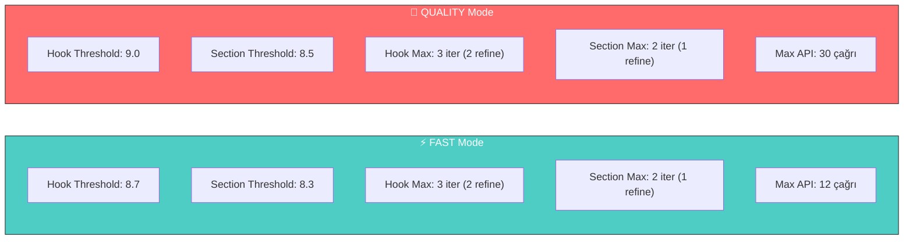

### Dual Jury Sistemi

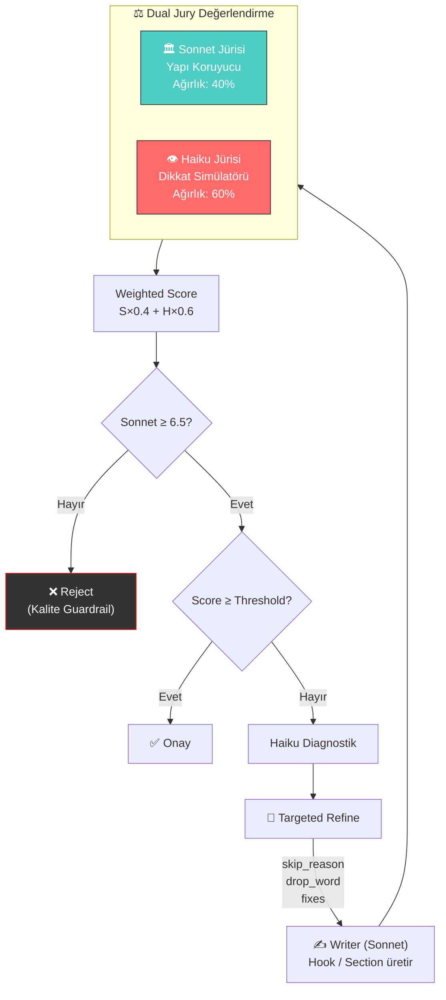

### Hook vs Section Karşılaştırması

| Özellik | Hook 🎯 | Section 📄 |
|---------|---------|-----------|
| İlk üretim | **3** varyant (batch) | **2** varyant |
| Threshold (Quality) | **9.0** | **8.5** |
| Max iterasyon | **3** (2 refine) | **2** (1 refine) |
| Tie-breaker | Clarity → Kısa kazanır | Outro: punch / Context: kısa |
| Etki alanı | İlk 1-3 saniye (binary) | Orta retention (kademeli) |
| **Self-optimization riski** | **🔴 Yüksek** | 🟢 Düşük |

### Targeted Refine (Cerrahi İyileştirme)

```
❌ Eski (Kör Refine):
  "Fix these issues: too predictable"

✅ Yeni (Cerrahi Refine):
  Viewer Attention Diagnostics:
  • Skip Reason: "Sounds like a History Channel intro"
  • Drop Word: "army" ← dikkat burada düşüyor
  • Attention Failure: Predictable phrasing
  Rewrite Constraints:
  • Replace predictable military framing
  • Introduce escalation or absurdity
  • Maintain factual accuracy
```

### KPI Proxy Metrics

| Metrik | Açıklama | Aralık |
|--------|----------|--------|
| `instant_clarity` | İlk saniyede ne olduğu anlaşılıyor mu? | 0-10 |
| `curiosity_gap` | "Sonra ne oldu?" merakı uyandırıyor mu? | 0-10 |
| `swipe_risk` | Kaydırma riski (yüksek = düşük risk) | 0-10 |
| `predicted_retention` | Tahmini izlenme yüzdesi | 0-100 |

---

## 🔬 Kalibrasyon ve Bilimsel Faz

### Dosya: `lambda/video_creator/calibration_report.py`

Sistem artık **spekülasyon değil, deney** yapıyor. Kalibrasyon raporu 8 farklı analizle evaluator'ın gerçekliğini test eder.

### Anti-Goodhart Mimari

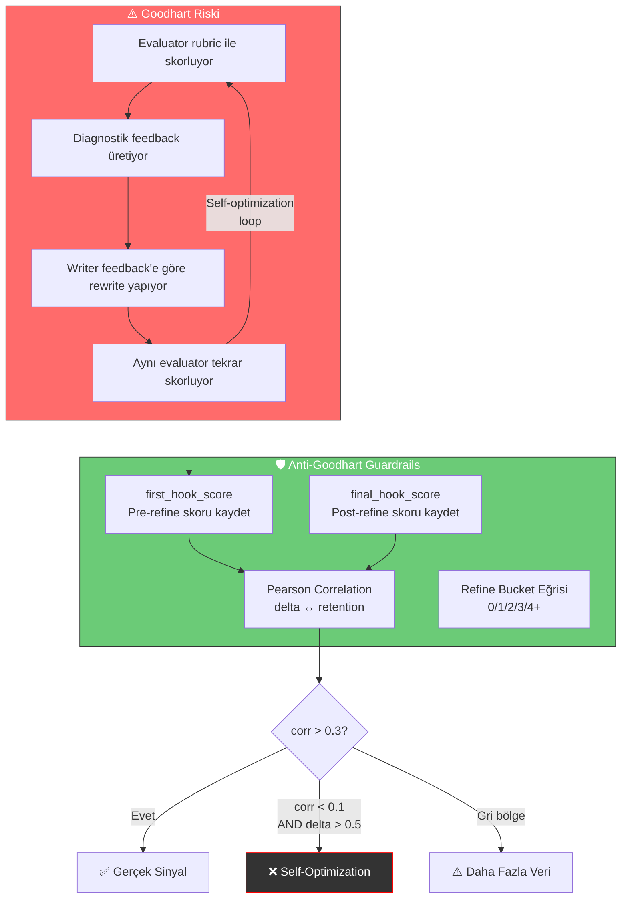

### 8 Analiz Modülü

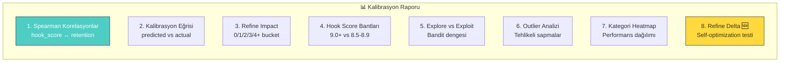

| # | Analiz | Ne Sorar? | Kritik Metrik |
|---|--------|-----------|---------------|
| 1 | **Spearman Korelasyonlar** | Skorlar retention'ı tahmin ediyor mu? | ρ değeri |
| 2 | **Kalibrasyon Eğrisi** | Yüksek tahmin = yüksek gerçek mi? | Bias (pp) |
| 3 | **Refine Impact** | Daha fazla refine = daha iyi mi? | Bucket eğrisi |
| 4 | **Hook Score Bantları** | 9.0 eşiği haklı mı? | Band retention farkı |
| 5 | **Explore vs Exploit** | Bandit yeterince keşfediyor mu? | Explore oranı |
| 6 | **Outlier Analizi** | Model nerede tehlikeli yanılıyor? | Max hata |
| 7 | **Kategori Heatmap** | Hangi kategori gerçekten kazanıyor? | Avg retention by category |
| 8 | **🆕 Refine Delta** | Evaluator kendini mi ödüllendiriyor? | Pearson(delta, retention) |

### Refine Delta Enstrümantasyonu

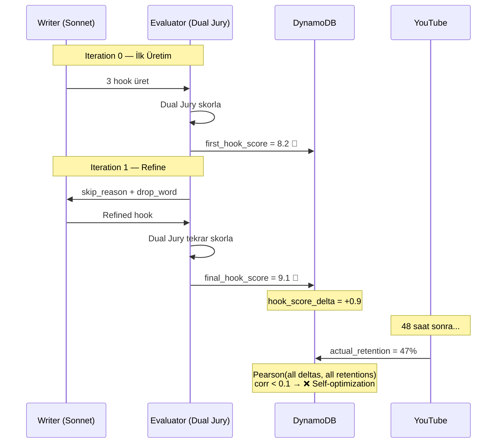

### Karar Matrisi

| Senaryo | hook_score_delta | retention_delta | Pearson corr | Aksiyon |
|---------|-----------------|-----------------|-------------|---------|
| **A — İdeal** | +0.3–0.8 | Pozitif | > 0.3 | ✅ Devam |
| **B — Selection Kazancı** | ≈ 0.0 | Pozitif | N/A | Refine gereksiz |
| **C — Goodhart** | ≥ 1.0 | Sıfır/Negatif | < 0.1 | ❌ Refine kesilir |

### Refine Bucket Eğrisi — Beklenen Senaryolar

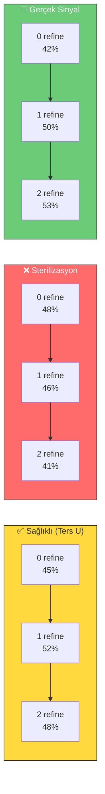

### DynamoDB'de Saklanan Kalibrasyon Verileri

| Alan | Kaynak | Açıklama |
|------|--------|----------|
| `hook_score` | pipeline | Final weighted hook score |
| `predicted_retention` | KPI evaluator | Tahmini retention (%) |
| `actual_retention` | YouTube Analytics | Gerçek retention (%) |
| `refine_total` | pipeline stats | Toplam refine sayısı |
| `hook_refines` | pipeline stats | Sadece hook refine sayısı |
| `first_hook_score` 🆕 | pipeline stats | İlk iterasyon hook skoru |
| `final_hook_score` 🆕 | pipeline stats | Son iterasyon hook skoru |
| `category` | topic selector | Video kategorisi |
| `pipeline_mode` | config | QUALITY / FAST |
| `hook_family` | config | contradiction / shock / mystery... |

---

## 🎯 Konu Seçim Stratejisi (History Buffet)

### Dosya: `lambda/video_creator/topic_selector.py`

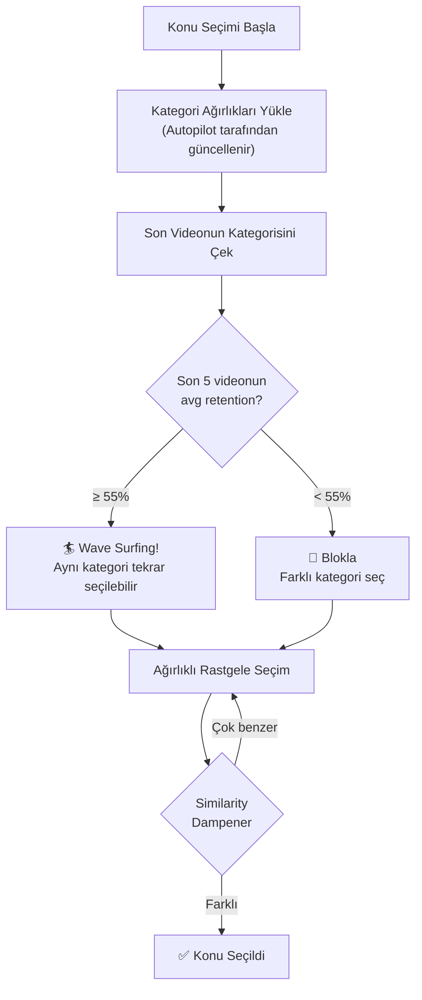

### Kategori Dağılımı

| Kategori | Ağırlık | Örnek Konular |
|----------|---------|---------------|
| 🔫 Modern Savaş | **30%** | Ghost Army, White Death, Manhattan Project |
| 🏛️ Antik Çağ | **25%** | Spartalılar, Sezar'ın intikamı, Mansa Musa |
| ⚔️ Ortaçağ | **20%** | Samurai vs Şövalye, Paris kuşatması, Cengiz Han |
| 🔍 Gizem | **15%** | Korsan Kralı, Karıncalanma Vebası, Alcatraz |
| 👑 Liderler | **10%** | Napoleon, Fatih Sultan Mehmet, İskender |
| 🌍 Antropoloji | **10%** | Aztek Ölüm Düdüğü, Tibet Gökyüzü Cenazesi |

### Retention-Aware Diversity

YouTube algoritması momentum sever. Bir kategori yüksek retention alıyorsa, seed audience zaten o kategoriden besleniyordur:

```python
RETENTION_WAVE_THRESHOLD = 55.0  # % — bu üstünde tekrara izin ver

if cat_retention >= RETENTION_WAVE_THRESHOLD:
    # 🏄 Wave Surfing: Dalga iyiyse sörf devam
else:
    weights[last_category] = 0.0  # Normal diversity bloklaması
```

---

## 📊 Virality Score (Performans Puanlama)

### Dosya: `lambda/video_creator/utils/analytics_score.py`

```
Virality Score = (Retention × 1.5 + Stopping Power × 2.0) × log₁₀(Views)
```

| Bileşen | Açıklama | Ağırlık |
|---------|----------|---------|
| **Retention** | Ortalama izlenme yüzdesi (%) | ×1.5 |
| **Stopping Power** | `(1.0 - Swipe Rate) × 100` | ×2.0 |
| **Volume** | `log₁₀(Views)` — hacim çarpanı | ×1.0 |

> **Not:** Minimum 100 view gerekir. Altındaki videolar 0 puan alır.

### Neden Like'ları Yok Sayıyoruz?

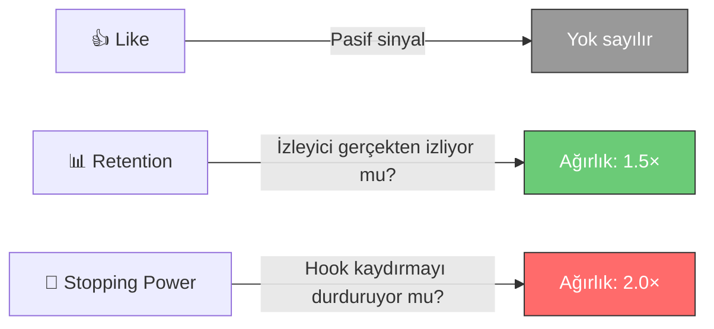

| Video Tipi | Retention | Swipe Rate | Views | Skor |
|------------|-----------|------------|-------|------|
| 🔥 Viral Hit | %80 | %30 | 10,000 | **~1,040** |
| 💎 Niche Gem | %95 | %10 | 1,000 | **~700** |
| 💀 Clickbait | %30 | %60 | 50,000 | **~587** |

---

## 🎬 Görsel Üretimi (Visual Director)

### Dosya: `lambda/video_creator/stock_fetcher.py`

### 4 Katmanlı Prompt Mimarisi

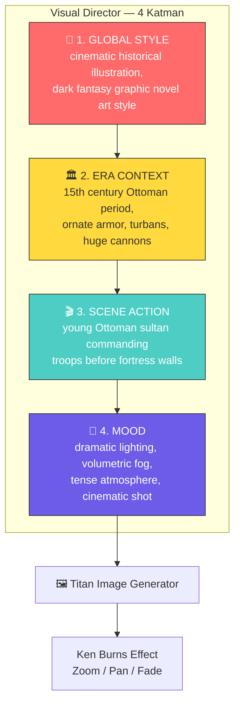

### Dönem Görsel DNA

| Dönem | Görsel DNA |
|-------|------------|
| Ottoman | Ornate armor, minarets, bombards |
| Roman | Legionary armor, marble columns |
| Viking | Longships, chainmail, foggy landscapes |
| Medieval | Knights, castles, heraldry banners |
| WW2 | 1940s gear, tanks, gritty war photography |
| Ancient | Stone temples, bronze weapons |
| Anthropology | Indigenous attire, ceremonial objects |

### Güvenlik: Titan Sanitizer

```python
# Prompt dönüşüm örnekleri
"war" → "soldiers in marching formation"
"Genghis Khan" → "13th century Mongol emperor in golden armor"
"blood" → "crimson sunset"

# Yüz kaçınma
"Mehmed II" → "young Ottoman ruler in golden armor"
"Napoleon" → "French military commander with bicorne hat"
```

---

## 🎙️ Ses & Müzik

### TTS (AWS Polly)

| Özellik | Değer |
|---------|-------|
| Ses tipi | Neural (doğal ses) |
| Sesler | Matthew, Brian, Stephen |
| Hız | 92-95% (biraz yavaş — dramatik) |
| Pitch | -5% ile -10% (derin ses) |

### Fonetik Yazım

```python
PHONETIC_REPLACEMENTS = {
    "Atatürk": "Ah-tah-turk",
    "Fatih": "Fah-teeh",
    "Constantinople": "Con-stan-tin-oh-pull",
    "Selahaddin": "Seh-lah-had-deen",
}
```

### Müzik Pipeline

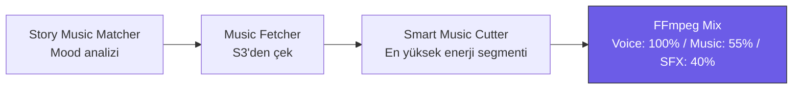

| Kategori | Ne Zaman? |
|----------|-----------|
| epic | Savaş, fetih, imparatorluk |
| emotional | Kişisel hikayeler, trajedi |
| documentary | Genel tarihsel anlatım |
| dramatic | Gerilimli anlar |
| oriental | Osmanlı, Arap, Asya |

---

## 🤖 Autopilot Sistemi

### Thompson Sampling — Kapalı Döngü

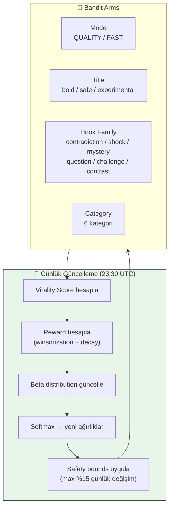

### Decay Weights

| Video Yaşı | Ağırlık |
|------------|---------|
| 0-7 gün | 1.0 |
| 8-14 gün | 0.5 |
| 15-21 gün | 0.25 |
| 22+ gün | 0.1 |

### Guardrails

- **Recovery Mode:** Art arda 3 video retention < %25 → otomatik QUALITY mode
- Günlük max ağırlık değişimi: **%15**
- Kategori ağırlıkları her zaman toplam **1.0**'a normalize
- Safety bounds ile aşırı uçlara kayma engellenir

### Prompt Memory (Pazar 21:00 UTC)

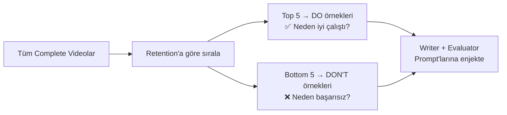

---

## 📊 YouTube Analytics Entegrasyonu

### Dosya: `lambda/video_creator/youtube_analytics.py`

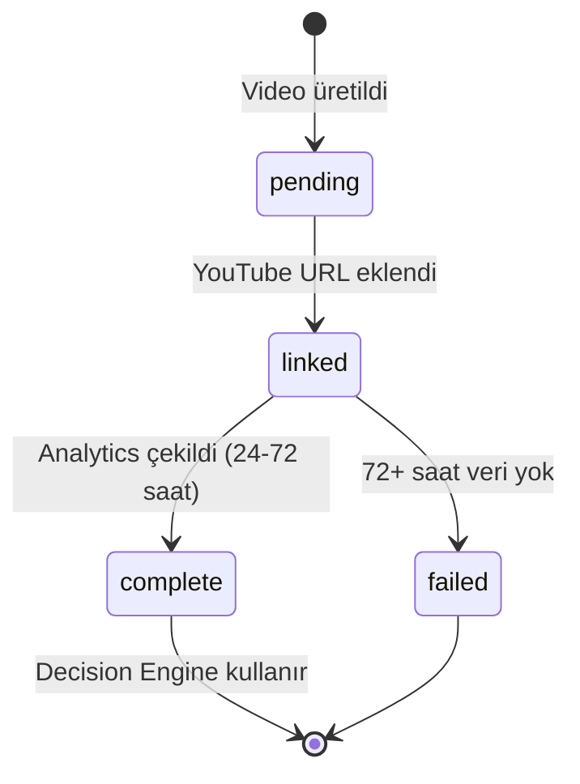

### Retry Stratejisi

| Video Yaşı | Aksiyon |
|------------|---------|
| < 24 saat | Atla (analytics hazır değil) |
| 24-72 saat | Dene, başarısızsa yarın tekrar |
| > 72 saat | Veri yoksa `failed` işaretle |

### DynamoDB — `shorts_video_metrics`

| Alan | Açıklama |
|------|----------|
| `video_id` | Benzersiz ID |
| `youtube_video_id` | YouTube video ID'si |
| `predicted_retention` | AI tahmini (%) |
| `actual_retention` | Gerçek YouTube değeri (%) |
| `hook_score` | Hook puanı (0-10) |
| `first_hook_score` 🆕 | Pre-refine hook skoru |
| `final_hook_score` 🆕 | Post-refine hook skoru |
| `refine_total` | Toplam refine sayısı |
| `status` | pending / linked / complete / failed |
| `calibration_eligible` | Kalibrasyon için uygun mu? |

---

## 🖥️ Admin Paneli & API

### Hosting: CloudFront + S3 (Terraform ile otomatik deploy)

### API Endpoints

| Method | Endpoint | Açıklama |
|--------|----------|----------|
| GET | /stats | Dashboard istatistikleri |
| GET | /videos | Video listesi (filtreli) |
| GET | /videos/{id} | Tek video detayı |
| PATCH | /videos/{id} | Video güncelle |
| DELETE | /videos/{id} | Video sil |
| POST | /videos/bulk | Toplu güncelleme (max 50) |
| POST | /generate | On-demand video üret |
| GET | /jobs | Son üretim işleri |
| GET | /jobs/{id} | İş detayı |
| GET | /logs | Yapısal loglar |

### Özellikler
- **Link Video**: YouTube URL ekle (otomatik ID parse)
- **Rate Limiting**: Dakikada 2 istek limiti
- **Idempotency**: `client_request_id` ile duplicate engelleme
- **Job Monitoring**: Real-time iş durumu ve loglar

---

## ☁️ AWS Altyapısı & Deployment

### Servis Haritası

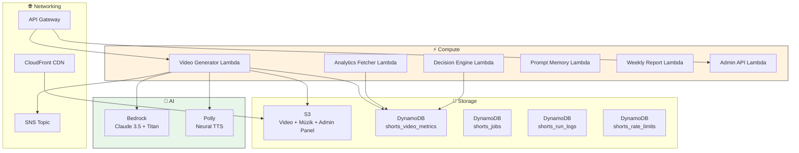

### EventBridge Zamanlamaları

| Lambda | Zamanlama | Açıklama |
|--------|-----------|----------|
| Video Generator | Her 8 saatte bir | Otomatik video üretimi |
| Analytics Fetcher | Her gün 23:00 UTC | YouTube verilerini çek |
| Decision Engine | Her gün 23:30 UTC | Autopilot ağırlıkları güncelle |
| Weekly Report | Pazar 20:00 UTC | Haftalık rapor |
| Prompt Memory | Pazar 21:00 UTC | DO/DON'T güncelle |

### Terraform Dosyaları

| Dosya | İçerik |
|-------|--------|
| `main.tf` | Provider, S3 video bucket, SNS |
| `lambda.tf` | Video Generator Lambda |
| `analytics_lambda.tf` | Analytics Fetcher Lambda |
| `autopilot_lambda.tf` | Decision Engine + Prompt Memory |
| `api_admin.tf` | API Gateway + Admin Lambda |
| `api_generate.tf` | /generate, /jobs, /logs API |
| `dynamodb_metrics.tf` | Video metrics tablosu |
| `dynamodb_jobs.tf` | Jobs, run_logs, rate_limits |
| `s3_admin_panel.tf` | Admin panel hosting |
| `iam.tf` | IAM rolleri ve politikaları |

### Kurulum

```powershell
# 1. Repo'yu klonla
git clone https://github.com/your-repo/historical-shorts.git
cd historical-shorts

# 2. Setup script'i çalıştır
.\setup.ps1    # Windows

# 3. Terraform deploy
cd terraform
cp terraform.tfvars.example terraform.tfvars
terraform init
terraform apply

# 4. YouTube OAuth token (bir kerelik)
cd ..
python get_youtube_token.py
```

### Lambda Layer'ları

| Layer | İçerik |
|-------|--------|
| FFmpeg Layer | FFmpeg binary (video işleme) |
| Python Deps | requests, pydantic vb. bağımlılıklar |

---

## 🔧 Konfigürasyon

### Pipeline Ayarları (`script_pipeline.py`)

```python
# Quality Mode
QUALITY_MODE_CONFIG = {
    "hook_threshold": 9.0,
    "section_threshold": 8.5,
    "hook_max_iterations": 3,    # 2 refine
    "section_max_iterations": 2,  # 1 refine
    "max_api_calls": 30
}

# Dual Jury
SONNET_WEIGHT = 0.4
HAIKU_WEIGHT = 0.6
SONNET_FLOOR = 6.5
```

### Autopilot Safety Bounds (`decision_engine.py`)

```python
WEIGHT_BOUNDS = {
    "mode": {"QUALITY": (0.3, 0.9), "FAST": (0.1, 0.5)},
    "title": {"bold": (0.2, 0.8), "safe": (0.1, 0.6), "experimental": (0.05, 0.4)},
}

DECAY_WEIGHTS = {7: 1.0, 14: 0.5, 21: 0.25, 999: 0.1}
```

### Ortam Değişkenleri (Lambda)

| Değişken | Açıklama |
|----------|----------|
| `AWS_REGION_NAME` | AWS bölgesi (us-east-1) |
| `METRICS_TABLE_NAME` | DynamoDB video metrics tablosu |
| `JOBS_TABLE_NAME` | DynamoDB jobs tablosu |
| `VIDEO_BUCKET` | S3 video bucket adı |
| `YOUTUBE_SECRET_ARN` | YouTube OAuth secret ARN |
| `SNS_TOPIC_ARN` | Bildirim SNS topic ARN |

---

## 📈 Maliyet Tahmini

| Servis | Günlük ~3 video |
|--------|-----------------|
| Lambda | ~$0.50 |
| Bedrock Claude | ~$1.50 |
| Bedrock Titan | ~$0.40 |
| Polly | ~$0.10 |
| S3 + DynamoDB | ~$0.04 |
| CloudFront | ~$0.01 |
| **Toplam** | **~$2.55/gün** |

---

## 🐛 Sorun Giderme

| Problem | Çözüm |
|---------|-------|
| Video çok kısa | Klip sürelerini kontrol et (8 saniye olmalı) |
| Titan görsel üretmiyor | `titan_sanitizer.py` loglarını kontrol et |
| CORS hatası | API Gateway redeploy: `create-deployment` |
| Analytics çekilmiyor | YouTube OAuth token kontrol et |
| Decision Engine çalışmıyor | `status=complete` + `calibration_eligible=true` video olmalı |
| Admin panel 403/404 | CloudFront invalidation: `--paths "/*"` |
| Job durumu "queued" | Lambda timeout kontrol et, `shorts_run_logs` incele |
| Kalibrasyon raporu boş | Min 15 complete video gerekli |

---

## 📂 Dosya Yapısı

```
historical/
├── README.md
├── setup.ps1 / setup.sh
├── get_youtube_token.py
│
├── admin-panel/
│   ├── index.html
│   ├── app.js
│   └── styles.css
│
├── lambda/
│   ├── layer/
│   │   ├── ffmpeg-layer.zip
│   │   └── python-deps.zip
│   │
│   ├── admin_api/
│   │   └── handler.py
│   │
│   └── video_creator/
│       ├── handler.py                 # Orchestrator + job tracking
│       ├── script_pipeline.py         # ⚖️ Dual Jury + Targeted Refine
│       ├── calibration_report.py      # 🔬 8-analiz kalibrasyon raporu
│       ├── topic_selector.py          # 🏄 History Buffet + Wave Surfing
│       ├── stock_fetcher.py           # 🎬 Visual Director
│       ├── titan_sanitizer.py         # Prompt güvenlik filtresi
│       ├── video_composer.py          # FFmpeg video render
│       ├── tts.py                     # AWS Polly TTS
│       ├── subtitle_gen.py            # Altyazı oluşturma
│       ├── music_fetcher.py           # S3'den müzik çekme
│       ├── smart_music_cutter.py      # Akıllı müzik kesimi
│       ├── story_music_matcher.py     # Mood-müzik eşleştirme
│       ├── sfx_generator.py           # Ses efektleri
│       ├── decision_engine.py         # 🎰 Thompson Sampling autopilot
│       ├── prompt_memory.py           # DO/DON'T hafıza
│       ├── weekly_report.py           # Haftalık performans raporu
│       ├── youtube_analytics.py       # YouTube API
│       ├── metrics_correlator.py      # Tahmin-gerçek karşılaştırma
│       ├── similarity_dampener.py     # Konu çeşitlilik kontrolü
│       ├── copyright_safety.py        # Telif hakkı takibi
│       ├── models.py                  # Data modeller
│       ├── utils/
│       │   └── analytics_score.py     # 📊 Virality Score
│       └── test_*.py                  # Test suites
│
├── terraform/                         # AWS altyapı (IaC)
│   ├── main.tf / lambda.tf / iam.tf / ...
│   └── autopilot_seed.json
│
└── tests/                             # Integration tests
```

---

*Son güncelleme: 2026-02-13 — Scientific Phase v2.4*
