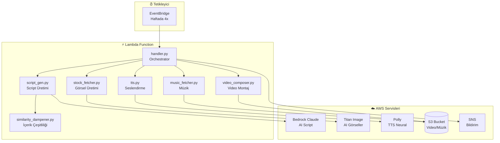

# 🎬 History YouTube Shorts Generator

AI-powered otomatik YouTube Shorts video oluşturucu. Tarihi içerikler üzerine viral-ready 15 saniyelik videolar üretir.

## 🏗️ Sistem Mimarisi



## 🔄 Video Oluşturma Akışı

```
┌─────────────────────────────────────────────────────────────────────────────┐
│                            VIDEO GENERATION PIPELINE                        │
├─────────────────────────────────────────────────────────────────────────────┤
│                                                                             │
│  1️⃣ SCRIPT GENERATION (script_gen.py)                                       │
│     └── Bedrock Claude → 15 saniyelik tarihi script                        │
│     └── Similarity Dampener → Tekrar engelleme                             │
│     └── Hook patterns → Viral-ready açılışlar                              │
│                                                                             │
│  2️⃣ VISUAL GENERATION (stock_fetcher.py)                                    │
│     └── Titan Image Generator → 4 segment görseli                          │
│     └── Ken Burns efekti → Dinamik zoom/pan                                │
│     └── Titan Sanitizer → Content filter bypass                            │
│                                                                             │
│  3️⃣ AUDIO GENERATION                                                        │
│     ├── tts.py → AWS Polly Neural seslendirme                              │
│     │   └── Fonetik sözlük (Türkçe/Latin isimler)                          │
│     ├── music_fetcher.py → S3'den royalty-free müzik                       │
│     │   └── Mood bazlı seçim (epic, nostalgic, war)                        │
│     └── sfx_generator.py → Bağlamsal ses efektleri                         │
│                                                                             │
│  4️⃣ VIDEO COMPOSITION (video_composer.py)                                   │
│     └── FFmpeg → Tüm öğeleri birleştir                                     │
│     └── ASS Subtitles → Animasyonlu altyazılar                             │
│     └── Old film effects → Tarihi görünüm                                  │
│                                                                             │
│  5️⃣ DELIVERY                                                                │
│     └── S3 Upload → Video depolama                                         │
│     └── SNS → E-posta bildirimi + download link                            │
│                                                                             │
└─────────────────────────────────────────────────────────────────────────────┘
```

## 📁 Proje Yapısı

```
historical/
├── 📄 README.md              # Bu dosya
├── 📄 ABOUT.md               # Detaylı açıklama
├── 🔧 setup.ps1/setup.sh     # Kurulum scriptleri
│
├── 🏗️ terraform/             # Infrastructure as Code
│   ├── main.tf              # S3, SNS, EventBridge, Budget
│   ├── lambda.tf            # Lambda + Layers
│   ├── iam.tf               # IAM roller ve politikalar
│   ├── variables.tf         # Değişkenler
│   └── outputs.tf           # Çıktılar
│
└── ⚡ lambda/
    ├── layer/               # Lambda layers
    │   ├── ffmpeg-layer.zip # FFmpeg binary
    │   └── python-deps.zip  # Python bağımlılıkları
    │
    └── video_creator/       # Ana Lambda kodu
        ├── handler.py           # 🎯 Ana orchestrator
        ├── script_gen.py        # 📝 Claude ile script üretimi
        ├── stock_fetcher.py     # 🎨 Titan ile görsel üretimi
        ├── tts.py               # 🎙️ Polly ile seslendirme
        ├── music_fetcher.py     # 🎵 S3'den müzik seçimi
        ├── video_composer.py    # 🎬 FFmpeg ile montaj
        ├── subtitle_gen.py      # 📺 ASS altyazı oluşturma
        ├── sfx_generator.py     # 🔊 Ses efektleri
        ├── similarity_dampener.py  # 🔄 İçerik çeşitliliği
        ├── titan_sanitizer.py   # 🛡️ Prompt temizleme
        ├── story_music_matcher.py  # 🎼 Müzik eşleştirme
        ├── smart_music_cutter.py   # ✂️ Müzik kırpma
        └── copyright_safety.py  # ©️ Telif takibi
```

## 🚀 Kurulum

### Gereksinimler
- AWS CLI yapılandırılmış
- Terraform >= 1.0
- Python 3.11+

### Deploy

```powershell
# 1. Terraform ile deploy
cd historical/terraform
terraform init
terraform apply

# 2. E-posta onayı
# AWS'den gelen SNS confirmation e-postasını onaylayın
```

### Manuel Çalıştırma

```powershell
# Async invoke (önerilen)
aws lambda invoke `
  --function-name youtube-shorts-video-generator `
  --payload "{}" `
  --invocation-type Event `
  --region us-east-1 `
  response.json

# Belirli konu ile
aws lambda invoke `
  --function-name youtube-shorts-video-generator `
  --payload '{"topic": "Fatih Sultan Mehmet", "era": "ottoman"}' `
  --invocation-type Event `
  --region us-east-1 `
  response.json
```

## 🎯 Özellikler

### İçerik Üretimi
| Özellik | Açıklama | Modül |
|---------|----------|-------|
| AI Script | Claude ile viral tarihi hikayeler | `script_gen.py` |
| Hook Kontrolü | Zayıf açılışları engeller | `script_gen.py` |
| 15s Garanti | Otomatik süre optimizasyonu | `script_gen.py` |
| Similarity Dampener | Tekrarlayan içerik engeli | `similarity_dampener.py` |

### Video Prodüksiyon
| Özellik | Açıklama | Modül |
|---------|----------|-------|
| AI Görseller | Titan ile tarihi görseller | `stock_fetcher.py` |
| Ken Burns | Dinamik zoom/pan efekti | `stock_fetcher.py` |
| TTS | Polly Neural seslendirme | `tts.py` |
| Fonetik Sözlük | Türkçe isimlerin doğru okunması | `tts.py` |
| Dinamik Müzik | Mood bazlı arka plan müziği | `music_fetcher.py` |
| Event SFX | Kılıç, top, kalabalık sesleri | `sfx_generator.py` |
| Animasyonlu Altyazı | Word-by-word reveal | `subtitle_gen.py` |

### İçerik Çeşitliliği (Similarity Dampener)
| Pattern | Eşik | Aksiyon |
|---------|------|---------|
| Hook | Son 10'un %30'u | BAN |
| Ending | %20 / %30 | PENALIZE / BAN |
| Break Line | Son 10'un %30'u | BAN |

**Dinamik Özellikler:**
- `MIN_HISTORY_FOR_BAN = 4` - 4 videodan az ise ban yok
- `escape_hatch` - Tıkandığında pattern yeniden yazma
- ISO timestamp sıralaması

## 🎵 Müzik Kategorileri

```
epic       → Savaş, fetih, kahramanlık
emotional  → Kişisel hikayeler, kayıplar
dramatic   → Gerilimli anlar, komplo
nostalgic  → Anılar, eski günler
war        → Muharebe sahneleri
```

## 🕰️ Dönem Stilleri

| Era | Görsel Stil | Ses Atmosferi |
|-----|-------------|---------------|
| `ancient` | Klasik yağlı boya | Antik ambiyans |
| `medieval` | Gotik tablo | Ortaçağ atmosferi |
| `ottoman` | Osmanlı minyatürü | Şark müziği |
| `early_20th` | Sepia fotoğraf | Nostaljik piyano |
| `ww1` / `ww2` | B&W fotoğraf | Epik/dramatik |

## 📊 İzleme (CloudWatch)

| Metrik | Sağlıklı | Alarm |
|--------|----------|-------|
| `escape_hatch_used` | ≤ 10% | > 25% |
| `hook_ban_rate` | ≤ 20% | > 40% |
| `ending_penalize_rate` | ≤ 30% | > 50% |

## ⚙️ Konfigürasyon

`terraform.tfvars`:
```hcl
aws_region         = "us-east-1"
notification_email = "your@email.com"
```

## 💰 Maliyet

- EventBridge: 4x/hafta = ~16 çağrı/ay
- Lambda: 5 dakika @ 3GB = ~$0.40/ay
- Bedrock Claude: ~$0.01/script
- Titan Image: ~$0.01/görsel
- Polly: ~$4/1M karakter
- S3: Minimal
- **Tahmini Toplam: ~$5-10/ay**

## 🔒 Telif Durumu

✅ Tüm içerik AI tarafından üretilmiştir:
- **Script**: AWS Bedrock Claude
- **Görseller**: AWS Titan Image Generator
- **Ses**: AWS Polly Neural
- **Müzik**: Royalty-free (S3'de önceden yüklenmiş)

## 📝 Lisans

Özel proje - Tüm hakları saklıdır.
